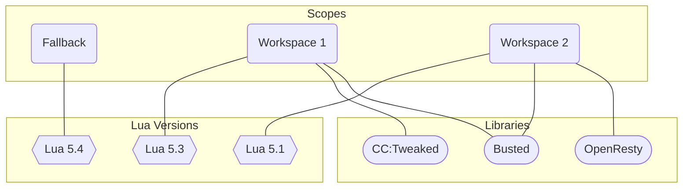

import Accordion from "../../components/common/Accordion.astro";
import AccordionGroup from "../../components/common/AccordionGroup.astro";
import Tabs from "../../components/common/Tabs.astro";
import Remark from "../../components/common/Remark.astro";

<AccordionGroup>
  <Accordion>
  <span slot="summary">
  ## Where can I find the log file?
  </span>

For debugging and a more detailed log file, you can add [`--loglevel=trace`](/wiki/usage#--loglevel) to [`misc.parameters`](/wiki/settings#miscparameters) or directly to the command line, if using it. If you are filing a bug report, please do so as it provides more info for the development team.

<Tabs
  active="VS Code"
  buttons={[
    { name: "VS Code", image: "/images/vscode.svg", accent: "#23a9f2" },
    { name: "Other", icon: "question", accent: "#ff158e" },
  ]}
>
  <div data-tab="VS Code">
    <Tabs
      active="Windows"
      buttons={[
        { name: "Windows", image: "/images/windows.svg", accent: "#23a9f2" },
        { name: "WSL", image: "/images/wsl.svg", accent: "#ffffff" },
        { name: "Linux/MacOS", image: "/images/linux.svg", accent: "#ffff00" },
      ]}
    >
      <div data-tab="Windows">
        `%homepath%\.vscode\extensions\sumneko.lua-X.X.X\server\log\`
      </div>
      <div data-tab="WSL">
        `\\wsl$\Ubuntu-20.04\home\USERNAME\.vscode-server\extensions\sumneko.lua-X.X.X\server\log\`
      </div>
      <div data-tab="Linux/MacOS">
        `~/.vscode/extensions/sumneko.lua-X.X.X/server/log/`
      </div>
    </Tabs>
    Replace the `X.X.X` in the file path with the version of the extension you are
    using.
  </div>
  {/* prettier-ignore */}
  <div data-tab="Other">
      - `/path/to/lua-language-server/log/`
      - `sumneko_lua/log/`
    </div>
</Tabs>

You can also specify a custom location for the logs through the [command line](/wiki/usage#--logpath). This can be specified using the [`misc.parameters`](/wiki/settings#miscparameters) setting when using Visual Studio Code.

  </Accordion>

  <Accordion>
    <span slot="summary">
    ## Why are there two workspaces/progress bars?
    </span>



When the server is started in workspace mode, the server creates (at least) two scopes: `workspace` and `<fallback>`. When a file that is not in your workspace is opened, it is opened in the `<fallback>` scope. Files in your workspace are opened in the `workspace` scope. This prevents "external" files from polluting the global scope of your workspace environment.

Users can then add definition files into their workspace through [`workspace.library`](/wiki/settings#workspacelibrary) using a [configuration file](/wiki/configuration#configuration-file). It is important to do this in a workspace-dependent file though, like VS Code's `.vscode/settings.json` file or a [`.luarc.json`](/wiki/configuration#luarcjson-file) file as it lets you only load the definition files that are actually needed. If they are defined globally, it can cause slowdowns as the libraries are **always** loaded.

When libraries are included globally, it can cause a few issues:

- When the server is started in single file mode, the startup will be slowed by the included libraries.
- When the server is started in workspace mode, there will be multiple progress bars displayed. Usually the `<fallback>` scope can load very quickly, before the progress bar is displayed, however, `<fallback>` will now be loading the library, slowing it down and showing the second progress bar. Fortunately, this does not actually affect the end loading speed as a given file will only be loaded once and will not be processed multiple times.

Make sure you are including libraries using a workspace-specific configuration file to prevent including a library in all of your projects.

  </Accordion>

  <Accordion>
      <span slot="summary">
    ## Why is the server scanning the wrong folder?
    </span>

When a workspace is opened, the client will send the URI of the directory to be scanned. When you open a single file, the client is supposed to send `null` for the URI as there is no workspace, just a single file. However, some clients will mistakenly send the URI of the extension, or worse, the home directory. The server will do as it is told and scan what is sent, which can obviously cause issues should the home directory be sent.

[Find your server log](#where-can-i-find-the-log-file) and then search for `Client init`. You should find something similar to the below with the `rootUri` field.

```plaintext
[17:58:27.365][debug][#0:script\provider\client.lua:32]: Client init	{
    capabilities = {...
    },
    clientInfo = {
        name = "Visual Studio Code - Insiders",
        version = "1.55.0-insider",
    },
    locale = "zh-cn",
    processId = 21048,
    rootPath = "c:\\Users\\sumneko\\.vscode-insiders\\extensions\\vscode-lua",
    rootUri = "file:///c%3A/Users/sumneko/.vscode-insiders/extensions/vscode-lua",
    trace = "off",
    workDoneToken = "a9e94178-eb6f-4277-ab21-6d81a5871041",
    workspaceFolders = {
        [1] = {
            name = "vscode-lua",
            uri = "file:///c%3A/Users/sumneko/.vscode-insiders/extensions/vscode-lua",
        },
    },
}
```

In Visual Studio Code, this should never happen as the [`sumneko.lua`](https://marketplace.visualstudio.com/items?itemName=sumneko.lua) client is developed by the creator of the language server. Should this be the case, [please open an issue](https://github.com/LuaLS/lua-language-server/issues/new?title=rootUri%20is%20incorrect%20in%20VS%20Code%20extension).

When not using Visual Studio Code, check the `rootUri` field in your configuration - some clients allow users to customize this value. If the value is correct or cannot be modified, please report the issue to the developer of the client you are using.

  </Accordion>

  <Accordion>
      <span slot="summary">
      ## How can I improve startup speeds?
      </span>

**TL;DR:** Only include necessary libraries and ignore as many files/directories as you can.

The most effective (and obvious) way to improve startup times is to load fewer files. The startup time of the server is proportional to the total size of all Lua files in your workspace. Try excluding unnecessary directories and files using [`workspace.ignoreDir`](/wiki/settings#workspaceignoredir).

You can use a [configuration file](/wiki/configuration#configuration-file) to specify different settings for each project/workspace. This allows you to include specific libraries only when they are needed. This helps reduce slow down across projects where the library is not needed.

To get a better understaning of startup times, you may want to view the [performance benchmarking test](/wiki/performance).

  </Accordion>
</AccordionGroup>

<br />
<br />
<br />

<div align="center">
  Question still unanswered? Ask away on the [discussions
  page](https://github.com/LuaLS/lua-language-server/discussions/categories/q-a)!
</div>

<Remark type="note" display="inline">
Please make sure to check for duplicate discussions first ❤️

It can help you find an answer quicker and helps keeps things organized.

</Remark>
